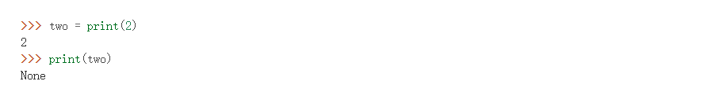

#### 1.2.6 None-Pure Print Function

print 是一个none pure function

> **Non-pure functions.** In addition to returning a value, applying a non-pure function can generate *side effects*, which make some change to the state of the interpreter or computer. A common side effect is to generate additional output beyond the return value, using the `print` function.

**Ex**


So 

> **Pure functions.** Functions have some input (their arguments) and return some output (the result of applying them). The built-in function


#### 1.3.7 Operator

```python
>>> from operator import truediv, floordiv
>>> truediv(5, 4)
1.25
>>> floordiv(5, 4)
1
```

#### 1.5.4 Boolean

and 和 or，左右两者都为真/假时，输出右边

**Ex**:

```python
>>> 13 and True
True
>>>0 or False
False
>>>False or 0
0
>>> True and 0      
0
>>> True and False
False
>>> 0 and True
0
>>> 1 and 3 and 6 and 10 and 15
15
>>> -1 and 1 > 0
```


**import Textbook**

Python 还包括**布尔运算符** `and`、`or`和`not`。这些运算符用于组合和操作布尔值。

- `not`返回以下表达式的相反布尔值，并且总是返回`True`or `False`。
- `and`按顺序计算表达式并在达到第一个假值时停止计算（短路），然后返回它。如果所有值都计算为真值，则返回最后一个值。
- `or`按顺序计算表达式并在第一个真值处短路并返回它。如果所有值的计算结果都是假值，则返回最后一个值。

例如：

```
>>> not None
True
>>> not True
False
>>> -1 and 0 and 1
0
>>> False or 9999 or 1/0
9999
```


#### 1.6.4 Function as Returned Values

**Ex1**

```python
def make_adder(n):
    """Return a function that takes one argument K and returns K + N.
    >>> add_three = make_adder(3)
    >>> add_three(4)
    7
    """
    def adder(k):
        return k + n
    return adder

make_adder(2000)(20)  # currying：transformation from function(f, g) to function(f)(g)
```


**Ex2**

```python
def make_adder(n):
    def adder(k):
        return k + n
    return adder
​
def square(x):
    return x * x
​
def triple(x):
    return 3 * x
​
def compose1(f, g):
    def h(x):
        return f(g(x))
    return h
​
squiple = compose1(square, triple)
squiple(5)
>>> 225
​
tripare = compose1(triple, square)
tripare(5)
>>> 75
​
squadder = compose1(square, make_adder(2))
squadder(3)
>>> 25
​
compose1(square, make_adder(2))(3) //与squadder(3)等价
>>> 25
```


#### 1.6.7 Lambda Expression

#### 


#### Theme: Environment( used diagram)

**Ex**

```python
wow = 6
def much(wow):
    if much == wow:
        such = lambda wow: 5
        def wow():
            return such
        return wow
    such = lambda wow: 4
    return wow()

wow = much(much(much))(wow)
```

https://goo.gl/rLDpDe


**Comment**

f3 的 wow，Return value 是 line 5下的 Lambda 函数，而不是 line 9 下的 Lambda函数，因为对 wow()的 call，使得返回到了 f1 的环境中， such也该使用 f1 中的such。

本质上，这道题表明了，即使两个函数（much）都定义在 Global 下，里面的定义，也有 f1，f2环境的区分。

第一次 call much ( much )，定义的 such 和 wow 都只在当前这一次 call 的 much 的环境内，即 f1 的环境。第二次 call much ( wow )，定义的 such 和 wow 在 f2 的环境内。可能这点细小入微的差别真的生动诠释了什么是 SICP。


**Ex2** import from http://albertwu.org/cs61a/review/environments/exam.html

```python
def funny(joke):
    hoax = joke + 1
    return funny(hoax)

def sad(joke):
    hoax = joke - 1
    return hoax + hoax

funny, sad = sad, funny
result = funny(sad(1))
```


**Ex3** import from http://albertwu.org/cs61a/review/environments/exam.html

```
def double(x):
    return double(x + x)
first = double
def double(y):
    return y + y
result = first(10)
```

result = 40

**Comment**: 定义的 double 函数中， return 后写的 double ，就是实实在在的 double ，绑定到了以 double 为名的函数上。


#### Theme:  Currying

```python
def lambda_curry2(func):
    """
    Returns a Curried version of a two-argument function FUNC.
    >>> from operator import add, mul, mod
    >>> curried_add = lambda_curry2(add)
    >>> add_three = curried_add(3)
    >>> add_three(5)
    8
    >>> curried_mul = lambda_curry2(mul)
    >>> mul_5 = curried_mul(5)
    >>> mul_5(42)
    210
    >>> lambda_curry2(mod)(123)(10)
    3
    """
    return lambda arg1: lambda arg2: func(arg1, arg2)
```


#### Theme: Self reference


**Ex**： import from "Hog" project


**Comment**：关键在于 f 要返回了一个描述当前 leader 的对象。而这个对象又可以进一步用来比较。最终给出的解决方案是：返回一个函数，这个函数的参数是 leader ，并把比较函数 say 包含了进去，使得 say 可以引用 leader 。

另外的理解：每次f比较好两个数，然后把这两个数据更新到自己的函数参数（可以看作返回了一个announce，也可以看作返回了一个say，只不过say借了announce的一个壳，利用了它的参数）Environment!!


**Ex**


**Comment**:

protect_secret先返回了一个函数get_secret，这个函数定义在pro的环境下，可以使用pro的参数，检测到输入的字符串与环境下的密码不一致，要将次数减一，并返回新的函数get_secret，但其实中间需要跳到global一次，“刷新下”环境，即（password，secret，2-1）。这样看来，自引用，其实是一次迭代更新原来的函数。**在pro的框架里，一直要定义到下一个自己引用的pro，这样才可以使下一个pro能继承自己的环境。**


#### Theme: Recursive

##### return value体现递归次数


##### 借助定义helper函数

**作用**


**Ex**


**Ex**


```python
def helper(result, i, step):
        if i == n:
            return result
        elif i % 8 == 0 or num_eights(i) > 0:
            return helper(result - step, i + 1, -step)
        else:
            return helper(result + step, i + 1, step)
    return helper(1, 1, 1)
```


#### Trick

##### max的妙用

**Ex**


```python
##我的原代码               //报错原因，1122返回-2。其实在数字“相同”和“相差1”两种情况下，都应返回0.即当计算为-1，应返回0.
if n<10: return 0
    return missing_digits(n//10)+n%10-n//10%10-1  
  //return missing_digits(n//10)+max(n%10-n//10%10-1,0)  //使用max，一行完善，0的时候返回0，-1的时候也返回0
```


##### print反向级联


**Comment**:利用了 Tree Recursion, 每一个grow下，分支出了grow和print，利用 f_then_g 中  ”if n"一直递归下去，直到n为假值，然后反向执行 Tree Recursion

